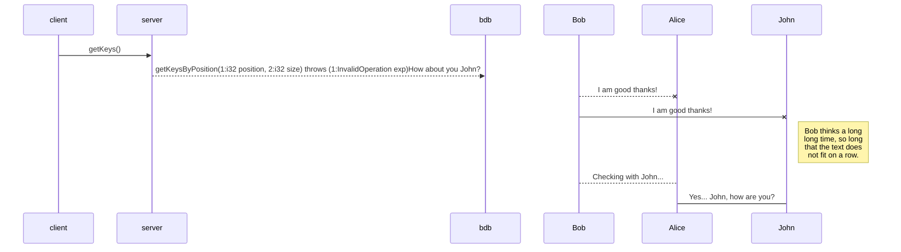

# THBDB

## getKeys

select all keys from bdb

### UML diagrams

```mermaid
sequenceDiagram
client ->> server: getKeys()
server-->> bdb: getKeysByPosition(1:i32 position, 2:i32  size) throws (1:InvalidOperation exp)How about you John?
Bob--x Alice: I am good thanks!
Bob-x John: I am good thanks!
Note right of John: Bob thinks a long<br/>long time, so long<br/>that the text does<br/>not fit on a row.

Bob-->Alice: Checking with John...
Alice->John: Yes... John, how are you?
```

<!--stackedit_data:
eyJoaXN0b3J5IjpbLTE4MDQwMzI0MzYsLTEzMzQxMjU3ODhdfQ
==
-->