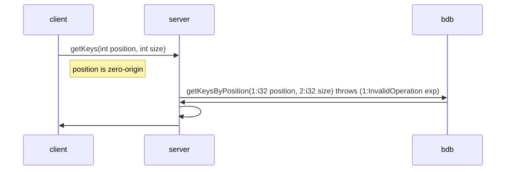

# THBDB

## getKeys

select all keys from bdb

### UML diagrams

```mermaid
sequenceDiagram
client ->> server: getKeys(int position, int size)

Note right of client: position is zero-origin

server ->> bdb: getKeysByPosition(1:i32 position, 2:i32  size) throws (1:InvalidOperation exp)


bdb ->> server: 
server ->> server: 
server ->> client: 


```

<!--stackedit_data:
eyJoaXN0b3J5IjpbMTQ3OTE1NzY5NCwtMTgyODgwNDE1OV19
-->