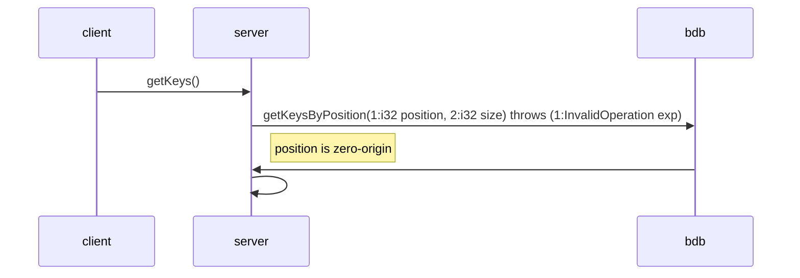

# THBDB

## getKeys

select all keys from bdb

### UML diagrams

```mermaid
sequenceDiagram
client ->> server: getKeys()
server ->> bdb: getKeysByPosition(1:i32 position, 2:i32  size) throws (1:InvalidOperation exp)

Note right of server: position is zero-origin
bdb ->> server: 
server ->> server: 


```

<!--stackedit_data:
eyJoaXN0b3J5IjpbLTg1MjEyMTI2MSwtMTgyODgwNDE1OV19
-->